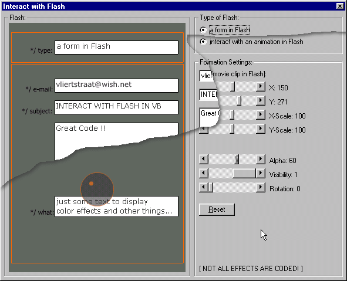



## Flash in VB \[interactive\]

### Description

This app shows how you can interact with

a Flash (SWF) in Visual Basic. Made in

VB 5 and Flash 4. Both the VB-source and

the Flash-source are included, and

commented. There's a simple way to control

a named movieclip in a Flash from VB, see

for yourself!
 
### More Info
 
Make sure you've got a ShockWave OCX! (Flash 4 or 5...) - Interact with textboxes and scrollbars

The objects in Flash act upon settings made by VB app.

None, just for fun

             |
---                |---
**Submitted On**   |2000-10-30 02:09:38
**By**             |[Tinus Unlimited Ltd\.](https://github.com/Planet-Source-Code/PSCIndex/blob/master/ByAuthor/tinus-unlimited-ltd.md)
**Level**          |Intermediate
**User Rating**    |4.3 (30 globes from 7 users)
**Compatibility**  |VB 5\.0, VB 6\.0
**Category**       |[Graphics](https://github.com/Planet-Source-Code/PSCIndex/blob/master/ByCategory/graphics__1-46.md)
**World**          |[Visual Basic](https://github.com/Planet-Source-Code/PSCIndex/blob/master/ByWorld/visual-basic.md)
**Archive File**   |[CODE\_UPLOAD1110810292000\.zip](https://github.com/Planet-Source-Code/tinus-unlimited-ltd-flash-in-vb-interactive__1-12397/archive/master.zip)

